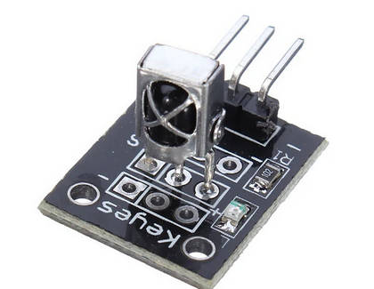

&#xa;    <h1 style="text-align: center">&#xa;      KY-022 r&#233;cepteur infra-rouge&#xa;    </h1>&#xa;  
<ul><li>&#xa;    <h2>&#xa;      documentation&#xa;    </h2>&#xa;  
<ul><li><a href="https://www.amazon.fr/AZDelivery-R%C3%A9cepteur-infrarouge-CHQ1838-capteur/dp/B089QKGRTL" target="_blank">~&nbsp;&#xa;    
&#xa;      Amazon&#xa;    
&#xa;    
&#xa;      composant CHQ1838&#xa;    
&#xa;  
</a>

<a href="https://docs.espressif.com/projects/esp-idf/en/v4.3/esp32/api-reference/peripherals/rmt.html" target="_blank">~&nbsp;ESPRESSIF RMT
</a>
<ul><li><a href="https://github.com/espressif/esp-idf/tree/v4.3/examples/peripherals/rmt/ir_protocols" target="_blank">~&nbsp;github ir_protocols
</a>

</li>

</ul>
<a href="https://esp32io.com/tutorials/esp32-ir-remote-control" target="_blank">~&nbsp;ESP32 IR Remote Control
</a>
&#xa;    
&#xa;      <b>HX1838</b>&#xa;    
&#xa;  
</li>
</ul>
</li>
<li>&#xa;    <h2>&#xa;      exemples&#xa;    </h2>&#xa;  
<ul><li><a href="https://www.robotique.site/tutoriel/utilisation-du-capteur-infrarouge-ky-032-et-une-telecommande-avec-la-carte-esp32/" target="_blank">~&nbsp;&#xa;    
&#xa;      Utilisation du capteur infrarouge KY-032 (python)&#xa;    
&#xa;  
</a>

<a href="https://www.esp32.com/viewtopic.php?f=13&t=34050" target="_blank">~&nbsp;Simple RMT pulse receiver
</a>
</li>
</ul>
</li>
<li>&#xa;    <h2>&#xa;      lang C&#xa;    </h2>&#xa;  

</li>
<li>&#xa;    <h2>&#xa;      FORTH&#xa;    </h2>&#xa;  
<ul><li>rmt.h
<ul><li>&#xa;    
&#xa;      #include &quot;driver/rmt.h&quot;&#xa;    
&#xa;    
&#xa;      &#xa;    
&#xa;    
&#xa;      #define OPTIONAL_RMT_VOCABULARY V(rmt)&#xa;    
&#xa;    
&#xa;      #define OPTIONAL_RMT_SUPPORT \&#xa;    
&#xa;    
&#xa;      &#160;&#160;YV(rmt, rmt_set_clk_div, n0 = rmt_set_clk_div((rmt_channel_t) n1, n0); NIP) \&#xa;    
&#xa;    
&#xa;      &#160;&#160;YV(rmt, rmt_get_clk_div, n0 = rmt_get_clk_div((rmt_channel_t) n1, b0); NIP) \&#xa;    
&#xa;    
&#xa;      &#160;&#160;YV(rmt, rmt_set_rx_idle_thresh, n0 = rmt_set_rx_idle_thresh((rmt_channel_t) n1, n0); NIP) \&#xa;    
&#xa;    
&#xa;      &#160;&#160;YV(rmt, rmt_get_rx_idle_thresh, \&#xa;    
&#xa;    
&#xa;      &#160;&#160;&#160;&#160;n0 = rmt_get_rx_idle_thresh((rmt_channel_t) n1, (uint16_t *) a0); NIP) \&#xa;    
&#xa;    
&#xa;      &#160;&#160;YV(rmt, rmt_set_mem_block_num, n0 = rmt_set_mem_block_num((rmt_channel_t) n1, n0); NIP) \&#xa;    
&#xa;    
&#xa;      &#160;&#160;YV(rmt, rmt_get_mem_block_num, n0 = rmt_get_mem_block_num((rmt_channel_t) n1, b0); NIP) \&#xa;    
&#xa;    
&#xa;      &#160;&#160;YV(rmt, rmt_set_tx_carrier, n0 = rmt_set_tx_carrier((rmt_channel_t) n4, n3, n2, n1, \&#xa;    
&#xa;    
&#xa;      &#160;&#160;&#160;&#160;&#160;&#160;&#160;&#160;&#160;&#160;&#160;&#160;&#160;&#160;&#160;&#160;&#160;&#160;&#160;&#160;&#160;&#160;&#160;&#160;&#160;&#160;&#160;&#160;&#160;&#160;&#160;&#160;&#160;&#160;&#160;&#160;&#160;&#160;&#160;&#160;&#160;&#160;&#160;&#160;&#160;&#160;&#160;&#160;(rmt_carrier_level_t) n0); NIPn(4)) \&#xa;    
&#xa;    
&#xa;      &#160;&#160;YV(rmt, rmt_set_mem_pd, n0 = rmt_set_mem_pd((rmt_channel_t) n1, n0); NIP) \&#xa;    
&#xa;    
&#xa;      &#160;&#160;YV(rmt, rmt_get_mem_pd, n0 = rmt_get_mem_pd((rmt_channel_t) n1, (bool *) a0); NIP) \&#xa;    
&#xa;    
&#xa;      &#160;&#160;YV(rmt, rmt_tx_start, n0 = rmt_tx_start((rmt_channel_t) n1, n0); NIP) \&#xa;    
&#xa;    
&#xa;      &#160;&#160;YV(rmt, rmt_tx_stop, n0 = rmt_tx_stop((rmt_channel_t) n0)) \&#xa;    
&#xa;    
&#xa;      &#160;&#160;YV(rmt, rmt_rx_start, n0 = rmt_rx_start((rmt_channel_t) n1, n0); NIP) \&#xa;    
&#xa;    
&#xa;      &#160;&#160;YV(rmt, rmt_rx_stop, n0 = rmt_rx_stop((rmt_channel_t) n0)) \&#xa;    
&#xa;    
&#xa;      &#160;&#160;YV(rmt, rmt_tx_memory_reset, n0 = rmt_tx_memory_reset((rmt_channel_t) n0)) \&#xa;    
&#xa;    
&#xa;      &#160;&#160;YV(rmt, rmt_rx_memory_reset, n0 = rmt_rx_memory_reset((rmt_channel_t) n0)) \&#xa;    
&#xa;    
&#xa;      &#160;&#160;YV(rmt, rmt_set_memory_owner, n0 = rmt_set_memory_owner((rmt_channel_t) n1, (rmt_mem_owner_t) n0); NIP) \&#xa;    
&#xa;    
&#xa;      &#160;&#160;YV(rmt, rmt_get_memory_owner, n0 = rmt_get_memory_owner((rmt_channel_t) n1, (rmt_mem_owner_t *) a0); NIP) \&#xa;    
&#xa;    
&#xa;      &#160;&#160;YV(rmt, rmt_set_tx_loop_mode, n0 = rmt_set_tx_loop_mode((rmt_channel_t) n1, n0); NIP) \&#xa;    
&#xa;    
&#xa;      &#160;&#160;YV(rmt, rmt_get_tx_loop_mode, n0 = rmt_get_tx_loop_mode((rmt_channel_t) n1, (bool *) a0); NIP) \&#xa;    
&#xa;    
&#xa;      &#160;&#160;YV(rmt, rmt_set_rx_filter, n0 = rmt_set_rx_filter((rmt_channel_t) n2, n1, n0); NIPn(2)) \&#xa;    
&#xa;    
&#xa;      &#160;&#160;YV(rmt, rmt_set_source_clk, n0 = rmt_set_source_clk((rmt_channel_t) n1, (rmt_source_clk_t) n0); NIP) \&#xa;    
&#xa;    
&#xa;      &#160;&#160;YV(rmt, rmt_get_source_clk, n0 = rmt_get_source_clk((rmt_channel_t) n1, (rmt_source_clk_t * ) a0); NIP) \&#xa;    
&#xa;    
&#xa;      &#160;&#160;YV(rmt, rmt_set_idle_level, n0 = rmt_set_idle_level((rmt_channel_t) n2, n1, \&#xa;    
&#xa;    
&#xa;      &#160;&#160;&#160;&#160;&#160;&#160;&#160;&#160;(rmt_idle_level_t) n0); NIPn(2)) \&#xa;    
&#xa;    
&#xa;      &#160;&#160;YV(rmt, rmt_get_idle_level, n0 = rmt_get_idle_level((rmt_channel_t) n2, \&#xa;    
&#xa;    
&#xa;      &#160;&#160;&#160;&#160;&#160;&#160;&#160;&#160;(bool *) a1, (rmt_idle_level_t *) a0); NIPn(2)) \&#xa;    
&#xa;    
&#xa;      &#160;&#160;YV(rmt, rmt_get_status, n0 = rmt_get_status((rmt_channel_t) n1, (uint32_t *) a0); NIP) \&#xa;    
&#xa;    
&#xa;      &#160;&#160;YV(rmt, rmt_set_rx_intr_en, n0 = rmt_set_rx_intr_en((rmt_channel_t) n1, n0); NIP) \&#xa;    
&#xa;    
&#xa;      &#160;&#160;YV(rmt, rmt_set_err_intr_en, n0 = rmt_set_err_intr_en((rmt_channel_t) n1, (rmt_mode_t) n0); NIP) \&#xa;    
&#xa;    
&#xa;      &#160;&#160;YV(rmt, rmt_set_tx_intr_en, n0 = rmt_set_tx_intr_en((rmt_channel_t) n1, n0); NIP) \&#xa;    
&#xa;    
&#xa;      &#160;&#160;YV(rmt, rmt_set_tx_thr_intr_en, n0 = rmt_set_tx_thr_intr_en((rmt_channel_t) n2, n1, n0); NIPn(2)) \&#xa;    
&#xa;    
&#xa;      &#160;&#160;YV(rmt, rmt_set_gpio, n0 = rmt_set_gpio((rmt_channel_t) n3, (rmt_mode_t) n2, (gpio_num_t) n1, n0); NIPn(3)) \&#xa;    
&#xa;    
&#xa;      &#160;&#160;YV(rmt, rmt_config, n0 = rmt_config((const rmt_config_t *) a0)) \&#xa;    
&#xa;    
&#xa;      &#160;&#160;YV(rmt, rmt_isr_register, n0 = rmt_isr_register((void (*)(void*)) a3, a2, n1, \&#xa;    
&#xa;    
&#xa;      &#160;&#160;&#160;&#160;&#160;&#160;&#160;&#160;(rmt_isr_handle_t *) a0); NIPn(3)) \&#xa;    
&#xa;    
&#xa;      &#160;&#160;YV(rmt, rmt_isr_deregister, n0 = rmt_isr_deregister((rmt_isr_handle_t) n0)) \&#xa;    
&#xa;    
&#xa;      &#160;&#160;YV(rmt, rmt_fill_tx_items, n0 = rmt_fill_tx_items((rmt_channel_t) n3, \&#xa;    
&#xa;    
&#xa;      &#160;&#160;&#160;&#160;&#160;&#160;&#160;&#160;(rmt_item32_t *) a2, n1, n0); NIPn(3)) \&#xa;    
&#xa;    
&#xa;      &#160;&#160;YV(rmt, rmt_driver_install, n0 = rmt_driver_install((rmt_channel_t) n2, n1, n0); NIPn(2)) \&#xa;    
&#xa;    
&#xa;      &#160;&#160;YV(rmt, rmt_driver_uinstall, n0 = rmt_driver_uninstall((rmt_channel_t) n0)) \&#xa;    
&#xa;    
&#xa;      &#160;&#160;YV(rmt, rmt_get_channel_status, n0 = rmt_get_channel_status((rmt_channel_status_result_t *) a0)) \&#xa;    
&#xa;    
&#xa;      &#160;&#160;YV(rmt, rmt_get_counter_clock, n0 = rmt_get_counter_clock((rmt_channel_t) n1, (uint32_t *) a0); NIP) \&#xa;    
&#xa;    
&#xa;      &#160;&#160;YV(rmt, rmt_write_items, n0 = rmt_write_items((rmt_channel_t) n3, (rmt_item32_t *) a2, n1, n0); NIPn(3)) \&#xa;    
&#xa;    
&#xa;      &#160;&#160;YV(rmt, rmt_wait_tx_done, n0 = rmt_wait_tx_done((rmt_channel_t) n1, n0); NIP) \&#xa;    
&#xa;    
&#xa;      &#160;&#160;YV(rmt, rmt_get_ringbuf_handle, n0 = rmt_get_ringbuf_handle((rmt_channel_t) n1, (RingbufHandle_t *) a0); NIP) \&#xa;    
&#xa;    
&#xa;      &#160;&#160;YV(rmt, rmt_translator_init, n0 = rmt_translator_init((rmt_channel_t) n1, (sample_to_rmt_t) n0); NIP) \&#xa;    
&#xa;    
&#xa;      &#160;&#160;YV(rmt, rmt_translator_set_context, n0 = rmt_translator_set_context((rmt_channel_t) n1, a0); NIP) \&#xa;    
&#xa;    
&#xa;      &#160;&#160;YV(rmt, rmt_translator_get_context, n0 = rmt_translator_get_context((const size_t *) a1, (void **) a0); NIP) \&#xa;    
&#xa;    
&#xa;      &#160;&#160;YV(rmt, rmt_write_sample, n0 = rmt_write_sample((rmt_channel_t) n3, b2, n1, n0); NIPn(3))&#xa;    
&#xa;  
</li>
</ul>
</li>
<li>voc rmt
<ul><li><a href="https://esp32.arduino-forth.com/help/index-esp32/word/rmt_config" target="_blank">~&nbsp;&#xa;    
&#xa;      rmt_config ( rmt_config_t -- fl )&#xa;    
&#xa;  
</a>

rmt_driver_...
<ul><li>rmt_driver_uinstall

</li>
<li>rmt_driver_install

</li>

</ul>
rmt_fill_tx_items

rmt_get_status

rmt_get_...
<ul><li>rmt_get_rx_idle_thresh

</li>
<li>rmt_get_mem_pd

</li>
<li>rmt_get_mem_block_num

</li>
<li><a href="https://esp32.arduino-forth.com/help/index-esp32/word/rmt_get_clk_div" target="_blank">~&nbsp;rmt_get_clk_div ( channel div_cnt -- fl )
</a>

</li>
<li>rmt_get_memory_owner

</li>
<li>rmt_get_tx_loop_mode

</li>
<li>rmt_get_source_clk

</li>
<li>rmt_get_idle_level

</li>
<li>rmt_get_channel_status

</li>
<li>rmt_get_counter_clock

</li>
<li>rmt_get_ringbuf_handle

</li>

</ul>
+ -
rmt_isr_...
<ul id="fold1_1" style="POSITION: relative; VISIBILITY: visible;"><li>rmt_isr_deregister

</li>
<li>rmt_isr_register

</li>

</ul>&#xa;    
&#xa;      rmt_set_...&#xa;    
&#xa;  
<ul><li><a href="https://esp32.arduino-forth.com/help/index-esp32/word/rmt_set_gpio" target="_blank">~&nbsp;rmt_set_gpio ( channel mode gpio_num invert_signal -- err )
</a>

</li>
<li>rmt_set_mem_pd

</li>
<li><a href="https://esp32.arduino-forth.com/help/index-esp32/word/rmt_set_clk_div" target="_blank">~&nbsp;rmt_set_clk_div ( channel div8 -- err )
</a>

</li>
<li><a href="https://esp32.arduino-forth.com/help/index-esp32/word/rmt_set_mem_block_num" target="_blank">~&nbsp;rmt_set_mem_block_num ( channel memnum8 -- err )
</a>

</li>
<li>rmt_set_memory_owner

</li>
<li>rmt_set_source_clk

</li>
<li>rmt_set_idle_level

</li>
<li>rmt_set_err_intr_en

</li>
<li>rmt_set_rx_...
<ul><li>rmt_set_rx_filter

</li>
<li>rmt_set_rx_intr_en

</li>
<li><a href="https://esp32.arduino-forth.com/help/index-esp32/word/rmt_set_rx_idle_thresh" target="_blank">~&nbsp;rmt_set_rx_idle_thresh
</a>

</li>

</ul>
</li>
<li>rmt_set_tx_...
<ul><li>rmt_set_tx_intr_en

</li>
<li>rmt_set_tx_thr_intr_en

</li>
<li>rmt_set_tx_loop_mode

</li>
<li>rmt_set_tx_carrier

</li>

</ul>
</li>

</ul>
rmt_rx_...
<ul><li><a href="https://esp32.arduino-forth.com/help/index-esp32/word/rmt_rx_start" target="_blank">~&nbsp;&#xa;    
&#xa;      rmt_rx_start ( channel f -- err )&#xa;    
&#xa;  
</a>

rmt_rx_stop

rmt_rx_memory_reset
</li>
</ul>
+ -
rmt_tx_...
<ul id="fold1_2" style="POSITION: relative; VISIBILITY: visible;"><li><a href="https://esp32.arduino-forth.com/help/index-esp32/word/rmt_tx_start" target="_blank">~&nbsp;rmt_tx_start
</a>

</li>
<li>rmt_tx_stop

</li>
<li>rmt_tx_memory_reset

</li>

</ul>
rmt_translator_...
<ul><li>rmt_translator_init

</li>
<li>rmt_translator_get_context

</li>
<li>rmt_translator_set_context

</li>

</ul>
rmt_wait_tx_done

rmt_write_...
<ul><li>rmt_write_sample

</li>
<li>rmt_write_items

</li>

</ul></li>
</ul>
</li>

</ul>
</li>

</ul>
