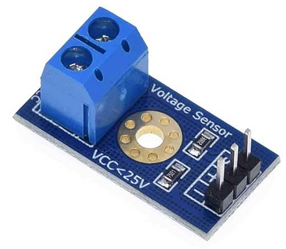

<h1 style="text-align: center">voltage sensor</h1>
<ul>
  <li><h2>langage C</h2>
  <ul>
    <li><a href="https://forum.arduino.cc/t/voltage-sensor-analog-with-esp32/953852" target="_blank">Voltage sensor (analog) with ESP32</a></li>
  </ul>
  <li><h2>general documentation</h2></li>
  <ul>
    <li><a href="https://www.ezlopi.com/tutorials-and-kits/b179-voltage-sensor/" target="_blank">B179 Voltage Sensor</a></li>
<a href="https://www.youtube.com/watch?v=OXieoH5IsAI" target="_blank">~&nbsp;&#xa;    
&#xa;      VOLTAGE SENSOR (0-25V) Arduino tutorial&#160;&#160;(youtube)&#xa;    
&#xa;  
</a>

<a href="https://www.youtube.com/watch?v=rfInUuU7T8A" target="_blank">~&nbsp;Voltage Measurement using Arduino
</a>
<a href="https://www.youtube.com/watch?app=desktop&v=coS9moqir8M" target="_blank">~&nbsp;&#xa;    
&#xa;      Monitoring Voltage with ESPHome&#xa;    
&#xa;    
&#xa;      D1 Mini ADC, and Home Assistant (youtube)&#xa;    
&#xa;  
</a>

<a href="https://www.circuits-diy.com/b25-0-25v-voltage-sensor-module/" target="_blank">~&nbsp;B25 0-25V Voltage Sensor Module
</a>
</li>
</ul></li>
</ul>
